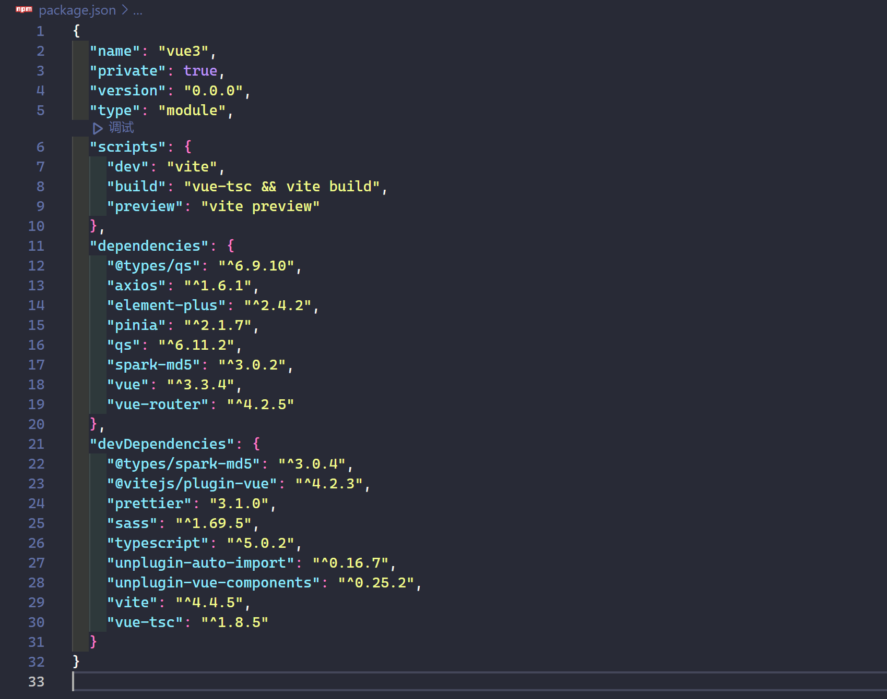
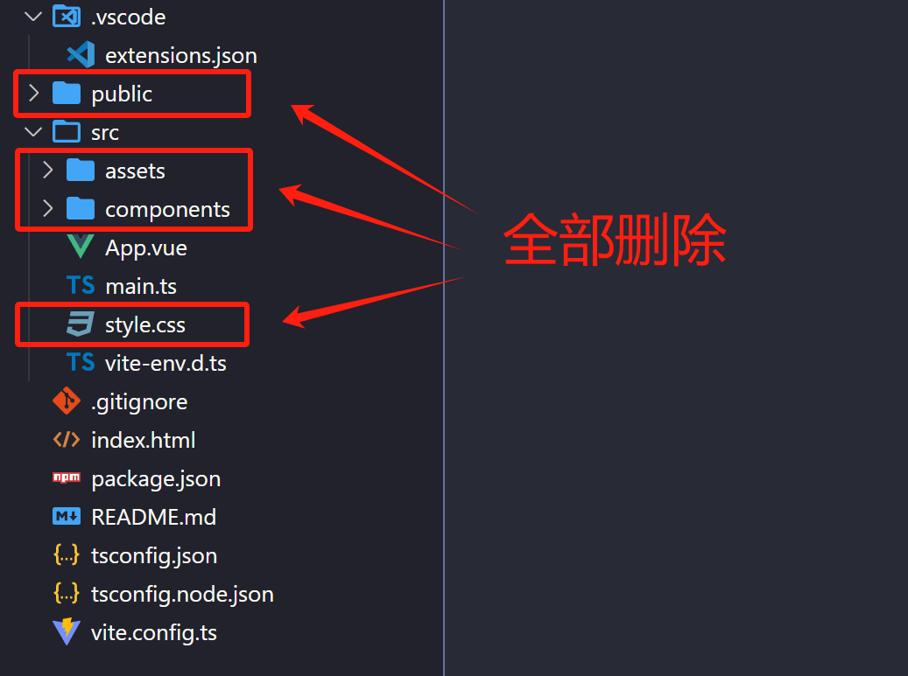

# vite创建vue3 + typescript带路由和element-plus ui框架项目的简易流程

## 先决条件

- 安装[nodejs](https://nodejs.org)
  - 验证安装的nodejs版本的控制台指令：`node -v`
  - 如果版本过低可以卸载后重新安装
- 确保脚本执行权限
  - 以管理员身份运行`PowerShell`
  - 执行`get-ExecutionPolicy`查看执行脚本的权限
    - 如果显示不是`RemoteSigned`就执行下一步
  - 执行`set-ExecutionPolicy RemoteSigned`修改执行权限

## 创建基本的vite + vue + ts的项目

- `VSCode`的必要的插件
  - `Vue Language Features (Volar)`
  - `TypeScript Vue Plugin (Volar)`
  - `Prettier - Code formatter`
  - `SCSS IntelliSense`
  - 如果有`Vetur`插件需要禁用或者卸载
- 执行指令：`npm create vite@latest 项目名称`创建项目
  - 界面是上下方向键选择选项，回车确认
  - 第一个选`Vue`
  - 第二个选`TypeScript`
  - 完成后用`vscode`单独打开创建的项目目录然后继续后面的步骤

## 项目配置和扩展

- 确保是打开的项目所在文件夹
- 执行`npm install`初始化项目（仅需要执行一次）
  - 如果项目莫名的异常也可以删除`node_modules`之后执行`npm install`
- 执行`npm run dev`启动项目开发服务（每次启动开发都需要执行）
- 添加项目其它依赖的功能模块
  - 路由模块：`npm install vue-router@4`
  - pinia状态管理：`npm install pinia`
  - prettier代码格式化：`npm install --save-dev --save-exact prettier`
  - 饿了么ui框架：`npm install element-plus --save`
  - 饿了么ui按需导入：`npm install -D unplugin-vue-components unplugin-auto-import`
  - axios网络请求：`npm install axios`
  - qs工具：`npm install qs`
  - qs工具类型定义：`npm i --save--dev @types/qs`
  - spark-md5密码库：`npm install spark-md5`
  - spark-md5密码库类型定义：`npm i --save-dev @types/spark-md5`
  - sass样式：`npm install -D sass`
- 模块的安装可以在`package.json`中验证
  
- 项目统一格式化配置（非必须，有需要可自行添加）
  - `vscode`工作区配置是在`.vscode/settings.json`文件中

    ```json
    {
      // 文件视图排除的配置
      "files.exclude": {
        "**/.git": true,
        "**/.svn": true,
        "**/.hg": true,
        "**/CVS": true,
        "**/.DS_Store": true,
        "**/Thumbs.db": true,
        "**/node_modules": true,
        "**/dist": true
      },
      "search.exclude": {
        "**/node_modules": true,
        "**/bower_components": true,
        "**/*.code-search": true
      },
      // typescript使用prettier格式化功能（需要安装prettier插件）
      "[typescript]": {
        "editor.defaultFormatter": "esbenp.prettier-vscode"
      },
      // html单行最大字符数量，配合prettier.htmlWhitespaceSensitivit配置可以避免较长的代码出现结束标签断行
      "html.format.wrapLineLength": 400,
      "prettier.htmlWhitespaceSensitivity": "strict",
      // 散文换行配置
      "prettier.proseWrap": "preserve",
      // javascript字符串变单引号（需要安装prettier插件）
      "prettier.singleQuote": true,
      // javascript行尾自动分号（需要安装prettier插件）
      "prettier.semi": false,
      // json项后面自动补逗号
      "prettier.trailingComma": "es5",
      // 换行符：crlf为windows平台，考虑跨平台可以修改了lf
      "prettier.endOfLine": "crlf",
      // html使用内置格式化功能
      "[html]": {
        "editor.defaultFormatter": "vscode.html-language-features"
      },
      // css文件格式化功能为prettier（需要安装prettier插件）
      "[css]": {
        "editor.defaultFormatter": "esbenp.prettier-vscode"
      },
      // javascript使用prettier格式化功能（需要安装prettier插件）
      "[javascript]": {
        "editor.defaultFormatter": "esbenp.prettier-vscode"
      },
      // json使用prettier格式化功能（需要安装prettier插件）
      "[json]": {
        "editor.defaultFormatter": "esbenp.prettier-vscode"
      },
      // vue文件格式化为prettier（需要安装prettier插件）
      "[vue]": {
        "editor.defaultFormatter": "esbenp.prettier-vscode"
      },
      "editor.fontFamily": "'Cascadia Code' , 'JetBrains Mono'"
    }
    ```

  - 项目的配置是在项目目录中的`.prettierrc.json`文件中

    ```json
    {
      "singleQuote": true,
      "htmlWhitespaceSensitivity": "strict",
      "printWidth": 400,
      "proseWrap": "preserve",
      "semi": false
    }
    ```

## 添加的文件

- 添加在目录中的

  - `auto-imports.d.ts`

    ```ts
    /* eslint-disable */
    /* prettier-ignore */
    // @ts-nocheck
    // noinspection JSUnusedGlobalSymbols
    // Generated by unplugin-auto-import
    export {}
    declare global {

    }
    ```

  - `componenis.d.ts`

    ```ts
    /* eslint-disable */
    /* prettier-ignore */
    // @ts-nocheck
    // Generated by unplugin-vue-components
    // Read more: https://github.com/vuejs/core/pull/3399
    export {}

    declare module 'vue' {
      export interface GlobalComponents {
        ElIcon: typeof import('element-plus/es')['ElIcon']
        RouterLink: typeof import('vue-router')['RouterLink']
        RouterView: typeof import('vue-router')['RouterView']
      }
    }
    ```

- 添加在src中的

  - `type.d.ts`

    ```ts
    declare module 'element-plus/dist/locale/zh-cn.mjs'
    ```

## 项目文件精简和个性化

- `index.html`修改
  - 去掉`link`标记，也就是拿掉默认的网站图标，或者修改成自己的图标
  - 修改`title`的内容为自己网站标题
- 删除`public`文件夹
- 删除`src/assets`文件夹
- 删除`src/components`文件夹
- 删除`style.css`文件
  

## 路由配置

- 在`src`中创建`view`目录
- 在`view`目录创建`Home.vue`文件
  - 内容为一行：`<template>网站建设中</template>`
- 在`src`中创建`router`目录
- 在`router`中创建`index.ts`文件
  - 内容为以下代码：
  
    ```ts
      import { createRouter, RouteRecordRaw, createWebHistory } from 'vue-router'

      const routes: RouteRecordRaw[] = [
        {
          // path就是地址栏访问的路径
          path: '/',
          // component就是对于地址的页面文件
          component: () => import('../view/Home.vue'),
        },
      ]

      // 创建router
      const router = createRouter({
        // 配置为Hash模式
        history: createWebHistory(import.meta.env.BASE_URL),
        // 配置toures
        routes,
        // 路由跳转时返回顶部
        scrollBehavior() {
          return { top: 0 }
        },
      })

      // 设置前置路由守卫
      router.beforeEach((to, from, next) => {
        console.log('路由前置：', to, from)
        next()
      })

      // 设置后置路由守卫
      router.afterEach((to, from, failure) => {
        console.log('路由后置：', to, from, failure)
      })

      export { router }
      ```

- 修改`src/main.ts`加入路由配置
  - 内容为以下代码：

    ```ts
      import { createApp } from 'vue'
      import App from './App.vue'
      import 'element-plus/dist/index.css'
      import { router } from './router/index'

      let app = createApp(App)
      app.use(router)
      app.mount('#app')
      ```

- 修改`src/App.vue`
  - 内容为以下代码：

    ```vue
      <template>
        <ElConfigProvider :locale="zhCn">
          <RouterView></RouterView>
        </ElConfigProvider>
      </template>

      <script setup lang="ts">
      import { ElConfigProvider } from 'element-plus'
      import zhCn from 'element-plus/dist/locale/zh-cn.mjs'
      </script>

      <style scoped></style>
    ```

- 控制的执行`npm run dev`启动项目
  - 默认看到的是`Home.vue`的内容
  - 地址栏加上`/about`看到的是`About.vue`的内容
  - 路由功能到此就配置成功
